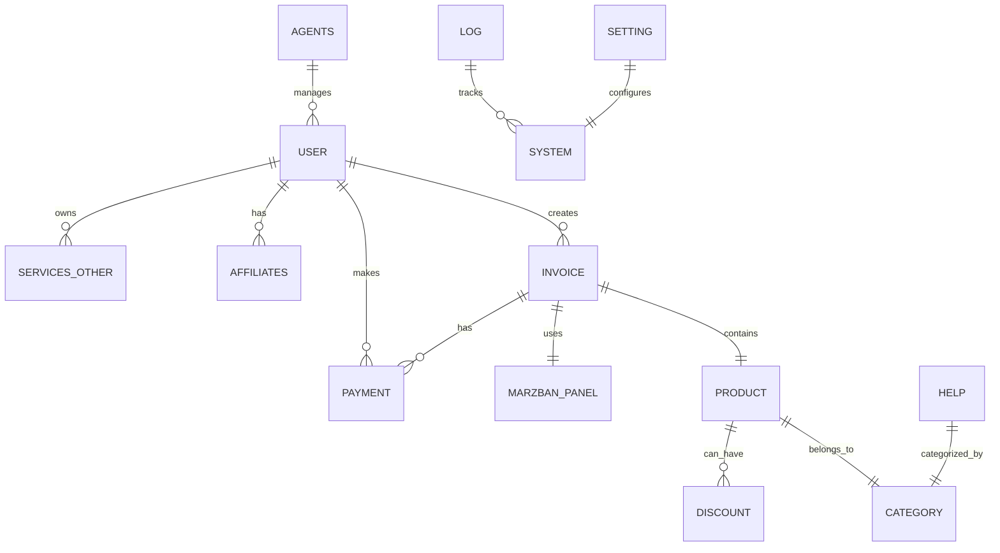

# 🗄️ ساختار کامل دیتابیس - Mirza Bot Pro

## 📋 فهرست جداول

1. [user](#1-جدول-user---اطلاعات-کاربران)
2. [invoice](#2-جدول-invoice---فاکتورها)
3. [product](#3-جدول-product---محصولات)
4. [payment](#4-جدول-payment---پرداخت-ها)
5. [marzban_panel](#5-جدول-marzban_panel---پنل-های-marzban)
6. [setting](#6-جدول-setting---تنظیمات-سیستم)
7. [help](#7-جدول-help---راهنما)
8. [category](#8-جدول-category---دسته-بندی-ها)
9. [discount](#9-جدول-discount---کدهای-تخفیف)
10. [topicid](#10-جدول-topicid---موضوعات-گزارش)
11. [affiliates](#11-جدول-affiliates---زیرمجموعه-ها)
12. [log](#12-جدول-log---لاگ-سیستم)
13. [services_other](#13-جدول-services_other---سرویس-های-دیگر)
14. [agents](#14-جدول-agents---نمایندگان)
15. [miniapp](#15-جدول-miniapp---تنظیمات-mini-app)

---

## 📊 نمودار ارتباط جداول



---

## 🔍 جزئیات جداول

### 1. جدول `user` - اطلاعات کاربران

```sql
CREATE TABLE user (
    id VARCHAR(500) PRIMARY KEY,              -- آیدی تلگرام کاربر
    limit_usertest INT(100) NOT NULL,         -- محدودیت تست رایگان
    roll_Status BOOL NOT NULL,                -- وضعیت رول
    username VARCHAR(500) NOT NULL,           -- یوزرنیم تلگرام
    Processing_value TEXT,                    -- مقدار پردازش
    Processing_value_one TEXT,                -- مقدار پردازش 1
    Processing_value_tow TEXT,                -- مقدار پردازش 2
    Processing_value_four TEXT,               -- مقدار پردازش 4
    step VARCHAR(500) NOT NULL,               -- مرحله فعلی در ربات
    description_blocking TEXT,                -- دلیل بلاک
    number VARCHAR(300) NOT NULL,             -- شماره موبایل
    Balance INT(255) NOT NULL,                -- موجودی کیف پول
    User_Status VARCHAR(500) NOT NULL,        -- وضعیت کاربر (Active/Blocked)
    pagenumber INT(10) NOT NULL,              -- شماره صفحه
    message_count VARCHAR(100) NOT NULL,      -- تعداد پیام‌ها
    last_message_time VARCHAR(100) NOT NULL,  -- زمان آخرین پیام
    agent VARCHAR(100) NOT NULL,              -- وضعیت نمایندگی
    affiliatescount VARCHAR(100) NOT NULL,    -- تعداد زیرمجموعه
    affiliates VARCHAR(100) NOT NULL,         -- آیدی معرف
    namecustom VARCHAR(300) NOT NULL,         -- نام سفارشی
    number_username VARCHAR(300) NOT NULL,    -- شماره یوزرنیم
    register VARCHAR(100) NOT NULL,           -- تاریخ ثبت‌نام
    verify VARCHAR(100) NOT NULL,             -- وضعیت تایید
    cardpayment VARCHAR(100) NOT NULL,        -- کارت پرداخت
    codeInvitation VARCHAR(100),              -- کد دعوت
    pricediscount VARCHAR(100) DEFAULT '0',   -- مبلغ تخفیف
    maxbuyagent VARCHAR(100) DEFAULT '0',     -- حداکثر خرید نماینده
    joinchannel VARCHAR(100) DEFAULT '0',     -- عضویت کانال
    checkstatus VARCHAR(50) DEFAULT '0',      -- وضعیت بررسی
    bottype TEXT,                             -- نوع ربات
    score INT(255) DEFAULT '0',               -- امتیاز
    limitchangeloc VARCHAR(50) DEFAULT '0',   -- محدودیت تغییر لوکیشن
    status_cron VARCHAR(20) DEFAULT '1',      -- وضعیت کرون
    expire VARCHAR(100),                      -- تاریخ انقضا
    token VARCHAR(100)                        -- توکن احراز هویت
) ENGINE=InnoDB DEFAULT CHARSET=utf8mb4 COLLATE utf8mb4_unicode_ci;
```

**ایندکس‌ها:**
```sql
CREATE INDEX idx_user_status ON user(User_Status);
CREATE INDEX idx_user_register ON user(register);
CREATE INDEX idx_user_balance ON user(Balance);
```

---

### 2. جدول `invoice` - فاکتورها

```sql
CREATE TABLE invoice (
    id INT(10) UNSIGNED AUTO_INCREMENT PRIMARY KEY,
    id_invoice VARCHAR(500) NOT NULL,         -- شناسه یکتای فاکتور
    id_user VARCHAR(500) NOT NULL,            -- آیدی کاربر
    username VARCHAR(500) NOT NULL,           -- نام کاربری سرویس
    Service_location VARCHAR(500),            -- لوکیشن سرور
    time_sell VARCHAR(500),                   -- زمان فروش
    name_product VARCHAR(500),                -- نام محصول
    price_product VARCHAR(500),               -- قیمت محصول
    Status VARCHAR(500),                      -- وضعیت (active/expired/disabled)
    note TEXT,                                -- یادداشت
    refral VARCHAR(500),                      -- کد معرف
    inboundid VARCHAR(500),                   -- آیدی inbound
    day VARCHAR(500),                         -- تعداد روز
    date_end VARCHAR(500),                    -- تاریخ پایان
    volume VARCHAR(500),                      -- حجم
    volume_end VARCHAR(500),                  -- حجم مصرفی
    volume_type VARCHAR(50),                  -- نوع حجم
    panel VARCHAR(500),                       -- نام پنل
    panel_id INT(10),                         -- آیدی پنل
    type_product VARCHAR(100),                -- نوع محصول
    config_text TEXT,                         -- متن کانفیگ
    qr_code TEXT,                             -- QR Code
    link_sub VARCHAR(1000),                   -- لینک subscription
    created_at TIMESTAMP DEFAULT CURRENT_TIMESTAMP,
    updated_at TIMESTAMP DEFAULT CURRENT_TIMESTAMP ON UPDATE CURRENT_TIMESTAMP
) ENGINE=InnoDB DEFAULT CHARSET=utf8mb4 COLLATE utf8mb4_unicode_ci;
```

**ایندکس‌ها:**
```sql
CREATE INDEX idx_invoice_user ON invoice(id_user);
CREATE INDEX idx_invoice_username ON invoice(username);
CREATE INDEX idx_invoice_status ON invoice(Status);
CREATE INDEX idx_invoice_time ON invoice(time_sell);
```

---

### 3. جدول `product` - محصولات

```sql
CREATE TABLE product (
    id INT(10) UNSIGNED AUTO_INCREMENT PRIMARY KEY,
    name_product VARCHAR(500) NOT NULL,       -- نام محصول
    price_product VARCHAR(500) NOT NULL,      -- قیمت
    Volume_constraint VARCHAR(500),           -- محدودیت حجم (GB)
    Location VARCHAR(500),                    -- لوکیشن سرور
    Service_time VARCHAR(500),                -- مدت زمان سرویس (روز)
    Status VARCHAR(500),                      -- وضعیت (active/inactive)
    limitusers VARCHAR(500),                  -- محدودیت کاربر
    desc TEXT,                                -- توضیحات
    category_id INT(10),                      -- آیدی دسته‌بندی
    discount_percent INT(3),                  -- درصد تخفیف
    panel_type VARCHAR(100),                  -- نوع پنل
    protocol VARCHAR(100),                    -- پروتکل
    sort_order INT(10) DEFAULT 0,             -- ترتیب نمایش
    icon VARCHAR(500),                        -- آیکون
    features TEXT,                            -- ویژگی‌ها (JSON)
    created_at TIMESTAMP DEFAULT CURRENT_TIMESTAMP,
    updated_at TIMESTAMP DEFAULT CURRENT_TIMESTAMP ON UPDATE CURRENT_TIMESTAMP
) ENGINE=InnoDB DEFAULT CHARSET=utf8mb4 COLLATE utf8mb4_unicode_ci;
```

**ایندکس‌ها:**
```sql
CREATE INDEX idx_product_status ON product(Status);
CREATE INDEX idx_product_location ON product(Location);
CREATE INDEX idx_product_category ON product(category_id);
```

---

### 4. جدول `payment` - پرداخت‌ها

```sql
CREATE TABLE payment (
    id INT(10) UNSIGNED AUTO_INCREMENT PRIMARY KEY,
    id_user VARCHAR(500) NOT NULL,            -- آیدی کاربر
    id_invoice VARCHAR(500),                  -- آیدی فاکتور
    time VARCHAR(500),                        -- زمان پرداخت
    price VARCHAR(500),                       -- مبلغ
    payment_Status VARCHAR(500),              -- وضعیت پرداخت
    payment_type VARCHAR(500),                -- نوع پرداخت
    transaction_id VARCHAR(500),              -- شناسه تراکنش
    gateway VARCHAR(100),                     -- درگاه پرداخت
    card_number VARCHAR(100),                 -- شماره کارت
    reference_id VARCHAR(500),                -- کد پیگیری
    description TEXT,                         -- توضیحات
    created_at TIMESTAMP DEFAULT CURRENT_TIMESTAMP
) ENGINE=InnoDB DEFAULT CHARSET=utf8mb4 COLLATE utf8mb4_unicode_ci;
```

**ایندکس‌ها:**
```sql
CREATE INDEX idx_payment_user ON payment(id_user);
CREATE INDEX idx_payment_invoice ON payment(id_invoice);
CREATE INDEX idx_payment_status ON payment(payment_Status);
CREATE INDEX idx_payment_time ON payment(time);
```

---

### 5. جدول `marzban_panel` - پنل‌های Marzban

```sql
CREATE TABLE marzban_panel (
    id INT(10) UNSIGNED AUTO_INCREMENT PRIMARY KEY,
    name_panel VARCHAR(500) NOT NULL,         -- نام پنل
    url_panel VARCHAR(500) NOT NULL,          -- آدرس پنل
    username_panel VARCHAR(500),              -- نام کاربری
    password_panel VARCHAR(500),              -- رمز عبور
    token_panel TEXT,                         -- توکن
    status_panel VARCHAR(100),                -- وضعیت
    type_panel VARCHAR(100),                  -- نوع پنل
    inbound_id VARCHAR(500),                  -- آیدی inbound
    flow VARCHAR(100),                        -- Flow
    protocol_panel VARCHAR(100),              -- پروتکل
    node_name VARCHAR(500),                   -- نام نود
    capacity INT(10),                         -- ظرفیت
    current_usage INT(10),                    -- استفاده فعلی
    last_check TIMESTAMP,                     -- آخرین بررسی
    settings TEXT,                            -- تنظیمات (JSON)
    created_at TIMESTAMP DEFAULT CURRENT_TIMESTAMP,
    updated_at TIMESTAMP DEFAULT CURRENT_TIMESTAMP ON UPDATE CURRENT_TIMESTAMP
) ENGINE=InnoDB DEFAULT CHARSET=utf8mb4 COLLATE utf8mb4_unicode_ci;
```

---

### 6. جدول `setting` - تنظیمات سیستم

```sql
CREATE TABLE setting (
    Bot_Status VARCHAR(200),                  -- وضعیت ربات
    roll_Status VARCHAR(200),                 -- وضعیت رول
    get_number VARCHAR(200),                  -- دریافت شماره
    iran_number VARCHAR(200),                 -- شماره ایران
    NotUser VARCHAR(200),                     -- کاربر غیرمجاز
    Channel_Report VARCHAR(600),              -- کانال گزارش
    limit_usertest_all VARCHAR(600),          -- محدودیت تست
    affiliatesstatus VARCHAR(600),            -- وضعیت زیرمجموعه
    affiliatespercentage VARCHAR(600),        -- درصد زیرمجموعه
    removedayc VARCHAR(600),                  -- حذف روزانه
    showcard VARCHAR(200),                    -- نمایش کارت
    numbercount VARCHAR(600),                 -- تعداد شماره
    support VARCHAR(600),                     -- پشتیبانی
    statusnewuser VARCHAR(600),               -- وضعیت کاربر جدید
    statusmessageall VARCHAR(600),            -- پیام همگانی
    keyboardmain TEXT,                        -- کیبورد اصلی
    helpbot TEXT,                             -- راهنمای ربات
    channelbot VARCHAR(600),                  -- کانال ربات
    blocktext TEXT,                           -- متن بلاک
    affiliatesdiscount VARCHAR(600),          -- تخفیف زیرمجموعه
    status_cron TEXT,                         -- وضعیت کرون‌ها
    api_token VARCHAR(500),                   -- توکن API
    maintenance_mode VARCHAR(50),             -- حالت تعمیرات
    maintenance_text TEXT,                    -- پیام تعمیرات
    backup_settings TEXT,                     -- تنظیمات بکاپ
    notification_settings TEXT                -- تنظیمات اعلان
) ENGINE=InnoDB DEFAULT CHARSET=utf8mb4 COLLATE utf8mb4_unicode_ci;
```

---

### 7. جدول `help` - راهنما

```sql
CREATE TABLE help (
    id INT(6) UNSIGNED AUTO_INCREMENT PRIMARY KEY,
    name_os VARCHAR(500) NOT NULL,            -- نام سیستم‌عامل
    Media_os VARCHAR(5000),                   -- مدیا
    type_Media_os VARCHAR(500),               -- نوع مدیا
    category TEXT,                            -- دسته‌بندی
    Description_os TEXT                       -- توضیحات
) ENGINE=InnoDB DEFAULT CHARSET=utf8mb4 COLLATE utf8mb4_unicode_ci;
```

---

### 8. جدول `category` - دسته‌بندی‌ها

```sql
CREATE TABLE category (
    id INT(10) UNSIGNED AUTO_INCREMENT PRIMARY KEY,
    name VARCHAR(500) NOT NULL,               -- نام دسته
    parent_id INT(10),                        -- دسته والد
    description TEXT,                         -- توضیحات
    icon VARCHAR(500),                        -- آیکون
    sort_order INT(10) DEFAULT 0,             -- ترتیب
    status VARCHAR(50) DEFAULT 'active',      -- وضعیت
    created_at TIMESTAMP DEFAULT CURRENT_TIMESTAMP
) ENGINE=InnoDB DEFAULT CHARSET=utf8mb4 COLLATE utf8mb4_unicode_ci;
```

---

### 9. جدول `discount` - کدهای تخفیف

```sql
CREATE TABLE discount (
    id INT(10) UNSIGNED AUTO_INCREMENT PRIMARY KEY,
    code VARCHAR(100) UNIQUE NOT NULL,        -- کد تخفیف
    type VARCHAR(50),                         -- نوع (percent/fixed)
    value VARCHAR(100),                       -- مقدار
    min_purchase VARCHAR(100),                -- حداقل خرید
    max_discount VARCHAR(100),                -- حداکثر تخفیف
    usage_limit INT(10),                      -- محدودیت استفاده
    used_count INT(10) DEFAULT 0,             -- تعداد استفاده
    user_limit INT(10),                       -- محدودیت هر کاربر
    start_date TIMESTAMP,                     -- تاریخ شروع
    end_date TIMESTAMP,                       -- تاریخ پایان
    status VARCHAR(50) DEFAULT 'active',      -- وضعیت
    products TEXT,                            -- محصولات مجاز (JSON)
    users TEXT,                               -- کاربران مجاز (JSON)
    created_at TIMESTAMP DEFAULT CURRENT_TIMESTAMP
) ENGINE=InnoDB DEFAULT CHARSET=utf8mb4 COLLATE utf8mb4_unicode_ci;
```

---

### 10. جدول `topicid` - موضوعات گزارش

```sql
CREATE TABLE topicid (
    id INT(10) UNSIGNED AUTO_INCREMENT PRIMARY KEY,
    name VARCHAR(500) NOT NULL,               -- نام موضوع
    idreport VARCHAR(500),                    -- آیدی گزارش
    type VARCHAR(100),                        -- نوع
    description TEXT                          -- توضیحات
) ENGINE=InnoDB DEFAULT CHARSET=utf8mb4 COLLATE utf8mb4_unicode_ci;
```

---

### 11. جدول `affiliates` - زیرمجموعه‌ها

```sql
CREATE TABLE affiliates (
    id INT(10) UNSIGNED AUTO_INCREMENT PRIMARY KEY,
    user_id VARCHAR(500) NOT NULL,            -- آیدی کاربر
    referrer_id VARCHAR(500),                 -- آیدی معرف
    commission_rate VARCHAR(100),             -- نرخ کمیسیون
    total_commission VARCHAR(100),            -- کل کمیسیون
    paid_commission VARCHAR(100),             -- کمیسیون پرداختی
    pending_commission VARCHAR(100),          -- کمیسیون معلق
    join_date TIMESTAMP DEFAULT CURRENT_TIMESTAMP,
    status VARCHAR(50) DEFAULT 'active'       -- وضعیت
) ENGINE=InnoDB DEFAULT CHARSET=utf8mb4 COLLATE utf8mb4_unicode_ci;
```

---

### 12. جدول `log` - لاگ سیستم

```sql
CREATE TABLE log (
    id INT(10) UNSIGNED AUTO_INCREMENT PRIMARY KEY,
    user_id VARCHAR(500),                     -- آیدی کاربر
    action VARCHAR(500),                      -- عملیات
    details TEXT,                             -- جزئیات
    ip_address VARCHAR(100),                  -- آدرس IP
    user_agent TEXT,                          -- User Agent
    timestamp TIMESTAMP DEFAULT CURRENT_TIMESTAMP,
    level VARCHAR(50),                        -- سطح (info/warning/error)
    module VARCHAR(100)                       -- ماژول
) ENGINE=InnoDB DEFAULT CHARSET=utf8mb4 COLLATE utf8mb4_unicode_ci;
```

---

### 13. جدول `services_other` - سرویس‌های دیگر

```sql
CREATE TABLE services_other (
    id INT(10) UNSIGNED AUTO_INCREMENT PRIMARY KEY,
    id_user VARCHAR(500) NOT NULL,            -- آیدی کاربر
    username VARCHAR(500),                    -- نام کاربری
    time VARCHAR(500),                        -- زمان
    price VARCHAR(500),                       -- قیمت
    type VARCHAR(500),                        -- نوع
    status VARCHAR(500),                      -- وضعیت
    details TEXT,                             -- جزئیات
    created_at TIMESTAMP DEFAULT CURRENT_TIMESTAMP
) ENGINE=InnoDB DEFAULT CHARSET=utf8mb4 COLLATE utf8mb4_unicode_ci;
```

---

### 14. جدول `agents` - نمایندگان

```sql
CREATE TABLE agents (
    id INT(10) UNSIGNED AUTO_INCREMENT PRIMARY KEY,
    user_id VARCHAR(500) UNIQUE NOT NULL,     -- آیدی کاربر
    agent_code VARCHAR(100) UNIQUE,           -- کد نماینده
    commission_rate VARCHAR(100),             -- نرخ کمیسیون
    total_sales VARCHAR(100),                 -- کل فروش
    total_commission VARCHAR(100),            -- کل کمیسیون
    balance VARCHAR(100),                     -- موجودی
    level VARCHAR(50),                        -- سطح
    status VARCHAR(50) DEFAULT 'active',      -- وضعیت
    settings TEXT,                            -- تنظیمات (JSON)
    created_at TIMESTAMP DEFAULT CURRENT_TIMESTAMP
) ENGINE=InnoDB DEFAULT CHARSET=utf8mb4 COLLATE utf8mb4_unicode_ci;
```

---

### 15. جدول `miniapp` - تنظیمات Mini App

```sql
CREATE TABLE miniapp (
    id INT(10) UNSIGNED AUTO_INCREMENT PRIMARY KEY,
    setting_key VARCHAR(100) UNIQUE NOT NULL, -- کلید تنظیم
    setting_value TEXT,                       -- مقدار
    description TEXT,                         -- توضیحات
    updated_at TIMESTAMP DEFAULT CURRENT_TIMESTAMP ON UPDATE CURRENT_TIMESTAMP
) ENGINE=InnoDB DEFAULT CHARSET=utf8mb4 COLLATE utf8mb4_unicode_ci;
```

---

## 🔧 Stored Procedures

### 1. پروسیجر محاسبه درآمد
```sql
DELIMITER //
CREATE PROCEDURE CalculateRevenue(IN start_date DATE, IN end_date DATE)
BEGIN
    SELECT 
        DATE(FROM_UNIXTIME(time)) as date,
        COUNT(*) as total_sales,
        SUM(CAST(price AS DECIMAL(10,2))) as total_revenue
    FROM payment
    WHERE payment_Status = 'paid'
        AND FROM_UNIXTIME(time) BETWEEN start_date AND end_date
    GROUP BY DATE(FROM_UNIXTIME(time))
    ORDER BY date DESC;
END //
DELIMITER ;
```

### 2. پروسیجر بررسی سرویس‌های منقضی
```sql
DELIMITER //
CREATE PROCEDURE CheckExpiredServices()
BEGIN
    UPDATE invoice 
    SET Status = 'expired'
    WHERE Status = 'active' 
        AND UNIX_TIMESTAMP() > date_end;
END //
DELIMITER ;
```

---

## 🎯 Triggers

### 1. تریگر بروزرسانی موجودی کاربر
```sql
DELIMITER //
CREATE TRIGGER UpdateUserBalance
AFTER INSERT ON payment
FOR EACH ROW
BEGIN
    IF NEW.payment_Status = 'paid' THEN
        UPDATE user 
        SET Balance = Balance + CAST(NEW.price AS SIGNED)
        WHERE id = NEW.id_user;
    END IF;
END //
DELIMITER ;
```

### 2. تریگر لاگ تغییرات
```sql
DELIMITER //
CREATE TRIGGER LogUserChanges
AFTER UPDATE ON user
FOR EACH ROW
BEGIN
    INSERT INTO log (user_id, action, details, timestamp)
    VALUES (NEW.id, 'user_update', 
            CONCAT('Balance changed from ', OLD.Balance, ' to ', NEW.Balance),
            NOW());
END //
DELIMITER ;
```

---

## 📈 Views

### 1. نمای آمار کاربران فعال
```sql
CREATE VIEW active_users_stats AS
SELECT 
    COUNT(*) as total_users,
    SUM(CASE WHEN User_Status = 'Active' THEN 1 ELSE 0 END) as active_users,
    SUM(Balance) as total_balance,
    AVG(Balance) as avg_balance
FROM user;
```

### 2. نمای درآمد ماهانه
```sql
CREATE VIEW monthly_revenue AS
SELECT 
    DATE_FORMAT(FROM_UNIXTIME(time), '%Y-%m') as month,
    COUNT(*) as total_transactions,
    SUM(CAST(price AS DECIMAL(10,2))) as revenue
FROM payment
WHERE payment_Status = 'paid'
GROUP BY DATE_FORMAT(FROM_UNIXTIME(time), '%Y-%m')
ORDER BY month DESC;
```

---

## 🔐 نکات امنیتی

1. **رمزنگاری داده‌های حساس**: رمزهای عبور پنل‌ها باید رمزنگاری شوند
2. **Prepared Statements**: برای جلوگیری از SQL Injection
3. **محدودیت دسترسی**: فقط localhost به دیتابیس دسترسی داشته باشد
4. **بکاپ منظم**: حداقل روزی یکبار
5. **لاگ تمام عملیات**: برای ردیابی تغییرات

---

## 🚀 بهینه‌سازی

### ایندکس‌های پیشنهادی:
```sql
-- برای جستجوی سریع کاربران
CREATE INDEX idx_user_username ON user(username);

-- برای گزارشات فروش
CREATE INDEX idx_payment_date ON payment(time, payment_Status);

-- برای بررسی سرویس‌های فعال
CREATE INDEX idx_invoice_active ON invoice(Status, date_end);
```

### پارتیشن‌بندی:
```sql
-- پارتیشن جدول payment بر اساس ماه
ALTER TABLE payment
PARTITION BY RANGE (UNIX_TIMESTAMP(created_at)) (
    PARTITION p2024_01 VALUES LESS THAN (UNIX_TIMESTAMP('2024-02-01')),
    PARTITION p2024_02 VALUES LESS THAN (UNIX_TIMESTAMP('2024-03-01')),
    -- ادامه پارتیشن‌ها
);
```

---

## 📊 نمونه Query های مفید

### 1. کاربران پرداخت کننده در ماه جاری
```sql
SELECT u.*, COUNT(p.id) as payment_count, SUM(CAST(p.price AS DECIMAL)) as total_paid
FROM user u
JOIN payment p ON u.id = p.id_user
WHERE p.payment_Status = 'paid'
    AND FROM_UNIXTIME(p.time) >= DATE_SUB(NOW(), INTERVAL 1 MONTH)
GROUP BY u.id
ORDER BY total_paid DESC;
```

### 2. محصولات پرفروش
```sql
SELECT p.*, COUNT(i.id) as sales_count
FROM product p
JOIN invoice i ON p.name_product = i.name_product
WHERE i.time_sell >= UNIX_TIMESTAMP(DATE_SUB(NOW(), INTERVAL 30 DAY))
GROUP BY p.id
ORDER BY sales_count DESC
LIMIT 10;
```

---

**نسخه Schema: 1.0.0**
